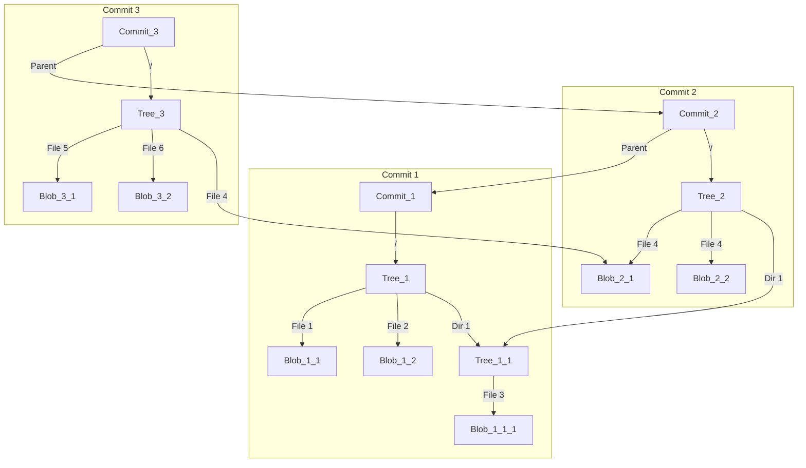

+++
title = 'Git 内部对象模型'
date = 2024-04-14T18:06:45+08:00
draft = false

[params]
mermaid = true
+++

# Git 内部对象模型

Git 是一个分布式版本控制系统，它的核心是一个简单的键值对数据库，这个数据库存储了所有的文件和目录的内容，以及它们的元数据。这些数据被称为 Git 对象，它们是 Git 的基本构建块。

## Git 对象

Git 对象有四种类型：blob、tree、commit 和 tag。每种类型的对象都有一个唯一的 SHA-1 标识符，这个标识符是根据对象的内容计算出来的。这个标识符可以用来检查对象是否被篡改，也可以用来查找对象。

### Blob

Blob 对象存储了文件的内容。它的内容是文件的原始数据，没有经过压缩或编码。Blob 对象的标识符是根据文件的内容计算出来的，所以如果文件的内容发生了变化，那么它的标识符也会发生变化。

### Tree

Tree 对象存储了目录的内容。它包含了目录中的所有文件和子目录的信息，以及它们的类型和标识符。Tree 对象的标识符是根据目录的内容计算出来的，所以如果目录的内容发生了变化，那么它的标识符也会发生变化。

### Commit

Commit 对象存储了提交的信息。它包含了提交的作者、提交的时间、提交的消息、以及提交所对应的树对象和父提交对象。Commit 对象的标识符是根据提交的内容计算出来的，所以如果提交的内容发生了变化，那么它的标识符也会发生变化。

### Tag

Tag 对象存储了标签的信息。它包含了标签的名称、标签的对象、标签的类型、以及标签的消息。Tag 对象的标识符是根据标签的内容计算出来的，所以如果标签的内容发生了变化，那么它的标识符也会发生变化。

## Git 对象的存储

Git 对象存储在 `.git/objects` 目录下，每个对象都有一个唯一的标识符，这个标识符是对象的内容的哈希值。Git 使用这个标识符来查找对象，所以如果对象的内容发生了变化，那么它的标识符也会发生变化。

Git 对象的存储格式是一个头部和一个内容。头部包含了对象的类型和大小，内容是对象的原始数据。Git 使用 zlib 压缩算法对对象的内容进行压缩，以节省存储空间。

## Git 对象的索引

Git 对象的索引存储在 `.git/index` 文件中，它包含了所有的对象的标识符和路径。Git 使用这个索引来查找对象，以及检查对象是否被篡改。

## 总结

Git 对象是 Git 的基本组成元素，它们存储了文件和目录的内容，以及它们的元数据。Git 对象有四种类型：blob、tree、commit 和 tag。每种类型的对象都有一个唯一的标识符，这个标识符是根据对象的内容计算出来的。Git 对象存储在 `.git/objects` 目录下，每个对象都有一个唯一的标识符，这个标识符是对象的内容的哈希值。Git 对象的索引存储在 `.git/index` 文件中，它包含了所有的对象的标识符和路径。Git 使用这个索引来查找对象，以及检查对象是否被篡改。

## 参考资料

- [Pro Git](https://git-scm.com/book/en/v2)
- [Git Internals - Git Objects](https://git-scm.com/book/en/v2/Git-Internals-Git-Objects)
- [Understanding Git under the hood](https://medium.com/swlh/understanding-git-under-the-hood-b1aeae1d02f5)

